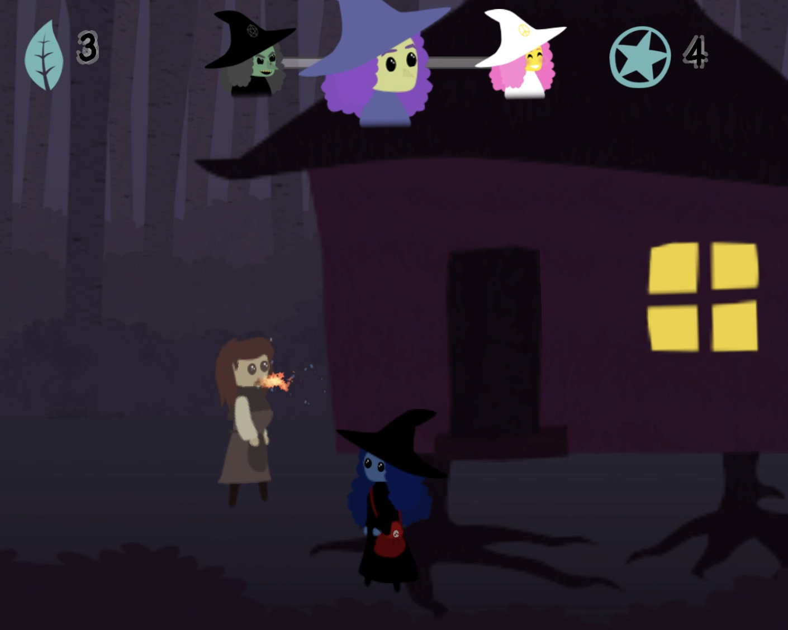

# Little Witch

## Description

Little Witch is a game about a forest dwelling witch whose mission is to cure the townsfolk of their magical maladies. Use ingredients like windflowers and icicle plant leaves to brew element-based potions, then experiment to find the right elixir for each sickness. But the clock is ticking! Any peasants still waiting for a cure at daybreak will storm off and start spreading rumors that you're a BAD WITCH. Keep the townsfolk happy for the whole fortnight to win!

## Screenshot    

## Release

Little Witch is a work in progress, expected to release around Halloween 2022 for Mac/PC. See [Progress here](PROGRESS.md).

## Built With

C#, Unity, Affinity Designer, Shadergraph

## Acknowledgement 

I owe a great thanks to many creators and educators online, especially [Brackeys](https://www.youtube.com/channel/UCYbK_tjZ2OrIZFBvU6CCMiA), [Sebastian Lague](https://www.youtube.com/c/SebastianLague), and [Ben Tristem](https://www.udemy.com/course/unitycourse/learn/lecture/8596142?start=0#overview). Their incredibly thorough and accessible content is also affordable / free! These creators' tutorials gave me the confidence and knowledge to start my own project and take my first steps into making a game without a tutorial. 

